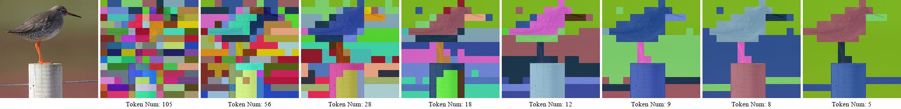
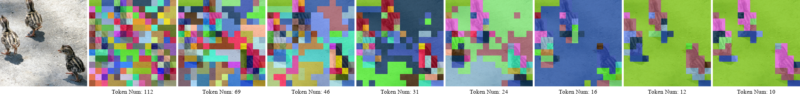
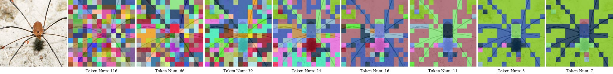
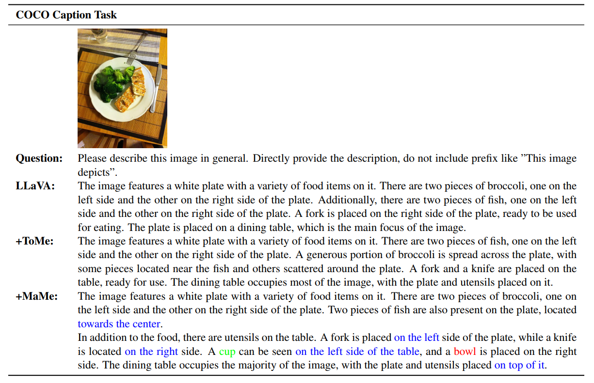

<p align="center">
  
</p>

# MaMe & MaRe: Matrix-Based Token Merging and Restoration

**MaMe** (**Ma**trix-based token **Me**rging) is a training-free, parameter-free token compression method for Vision Transformers. **MaRe** (**Ma**trix-based token **Re**storation) is MaMe's inverse operation to form a MaMe + MaRe pipeline for generation tasks. All operations are expressed as dense matrix multiplications and element-wise ops, making the pipeline fully differentiable and GPU-friendly without any discrete sorting, top-k selection, or clustering.

---

## Overview

| Property | MaMe / MaRe |
|---|---|
| Training required | ✗ (plug-and-play) |
| Extra parameters | ✗ |
| Differentiable | ✓ |
| Irregular indexing / gather-scatter | ✗ |
| Adaptive compression ratio | ✓ (input-driven, threshold τ) |
| Token restoration | ✓ (MaRe) |

---

## ViT Image Classification

MaMe is applied to the first 8 layers of pre-trained ViT models without any fine-tuning. More results (fine-tuning, zero-shot classification, video) are available in the paper.

### Training-Free Results (ImageNet-1K, A100, batch 1024, FP16)

| Model | Method | FLOPs (G) | Throughput (img/s) | Top-1 (%) |
|---|---|---|---|---|
| ViT-S (DeiT) | Baseline | 4.6 | 5039 | 79.82 |
| | EViT | 2.3 | 8950 | 73.83 |
| | ToMe | 2.3 | 8874 | 77.99 |
| | DiffRate | 2.3 | 8875 | 78.75 |
| | **MaMe** | **2.3** | **9015** | **78.61** |
| ViT-B (DeiT) | Baseline | 17.6 | 2130 | 81.83 |
| | EViT | 8.7 | 4230 | 74.61 |
| | ToMe | 8.8 | 4023 | 77.84 |
| | DiffRate | 8.7 | 4124 | 78.98 |
| | **MaMe** | **8.7** | **4117** | **79.80** |
| ViT-B (MAE) | Baseline | 17.6 | 2130 | 83.72 |
| | **MaMe** | **8.7** | **5418** | **79.83** |
| ViT-L (MAE) | Baseline | 61.6 | 758 | 85.95 |
| | **MaMe** | **31.0** | **2764** | **84.81** |
| ViT-H (MAE) | Baseline | 167.4 | 299 | 86.88 |
| | **MaMe** | **93.2** | **908** | **85.51** |

### Visualisation

The figure below shows the token progression through the first 8 blocks of AugReg ViT-B/16 with MaMe. Each colour square represents a distinct token.





---

## COCO Caption (LLaVA-1.5-7B)

MaMe is applied to the **visual encoder** of [LLaVA-1.5-7B](https://llava-vl.github.io/), reducing the number of visual tokens fed into the language model. Evaluated with [VLMEvalKit](https://github.com/open-compass/VLMEvalKit) on COCO Caption.

| Method | Latency (s) | Bleu-1 | Bleu-2 | Bleu-3 | Bleu-4 | ROUGE\_L | **CIDEr** |
|---|---|---|---|---|---|---|---|
| LLaVA-1.5-7B | 3.12 | 20.72 | 13.28 | 8.08 | 4.93 | 20.94 | 0.71 |
| + ToMe (r=8) | 2.30 | 20.15 | 12.90 | 7.90 | 4.89 | 21.67 | 1.60 |
| **+ MaMe (τ=0.8)** | **2.61** | 20.10 | 12.87 | 7.87 | 4.83 | 21.69 | **2.71** |

MaMe achieves a **CIDEr score of 2.71** — a **3.8× improvement** over the baseline (0.71) and **69% higher** than ToMe (1.60) — while reducing latency by 16%.  The gains trace back to MaMe's high-pass effect: by merging redundant low-frequency tokens and preserving distinctive detail tokens, the language model receives a more focused visual representation, leading to more spatially precise and complete descriptions.

### Qualitative Example



---

## Image Generation

For diffusion models, MaMe is inserted inside each transformer block of the U-Net/DiT to shorten the self-attention sequence, and MaRe follows to restore the full spatial resolution before the residual connection.  The MaMe+MaRe pipeline reduces per-step latency while the high-pass effect of MaMe **enhances high-frequency texture details** in the generated image.

Baseline: Stable Diffusion v2.1.  Compared against [ToMe-SD](https://github.com/dbolya/tomesd).

The combined images below show (left → right): **SD v2.1 baseline** | **ToMe-SD** | **MaMe+MaRe**.  MaMe+MaRe recovers finer hair strands and fur textures that ToMe-SD loses.

![[SD baseline | ToMe-SD | MaMe+MaRe] — Siberian tiger fur detail](<figures/A Siberian tiger with a thick _combined.png>)

![[SD baseline | ToMe-SD | MaMe+MaRe] — Chow Chow dog fur detail](<figures/A fluffy Chow Chow dog lying i_combined.png>)

![[SD baseline | ToMe-SD | MaMe+MaRe] — Van Gogh "Vase with Twelve Sunflowers"](<figures/a painting titled vase with twelve sunflowers_combined.png>)

![[SD baseline | ToMe-SD | MaMe+MaRe] — Cézanne "Still Life with Apples and Oranges"](<figures/a painting titled still life with apples and orang_combined.png>)

Moreover, We can control the clarity and sharpness of the generated image by adjusting the similarity threshold.


---

## Acknowledgements

This codebase borrows some code from [ToMe](https://github.com/facebookresearch/tome) and [ToMe-SD](https://github.com/dbolya/tomesd). Thanks to the authors for their excellent work.

---

## Citation

```bibtex
@article{mame2026,
  title   = {MaMe: Matrix-Based Token Merging},
  author  = {Simin Huo, Ning Li},
  booktitle={Computer Vision and Pattern Recognition Conference, Findings Track}
  year    = {2026}
}
```
